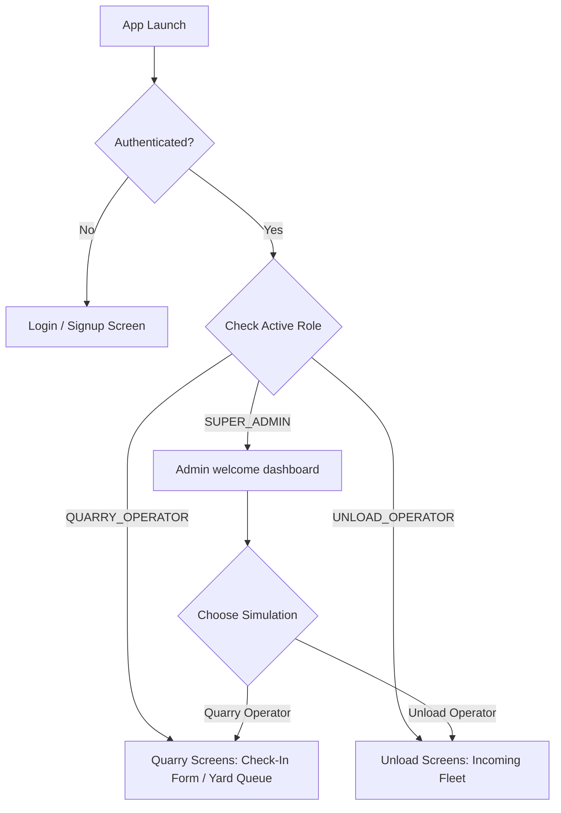

# San Mines Client App - AI Knowledge Guide

This document defines the architecture, state management, screen routing, local persistence, and design conventions of the React Native client application (`SM-Client`). It serves as a repository guide for AI agents.

---

## 1. Technical Stack & Dependencies
- **Core Framework**: React Native (0.81.x) with Expo (54.0.x)
- **Language**: TypeScript
- **Database & Auth Integration**: Supabase JS Client (`@supabase/supabase-js`)
- **Icons**: Lucide React Native (`lucide-react-native`)
- **Local Cache**: React Native AsyncStorage (`@react-native-async-storage/async-storage`)
- **Safe Area**: React Native Safe Area Context (`react-native-safe-area-context`)

---

## 2. Directory Structure
```
SM-Client/
├── App.tsx                 # Main application controller, base routes, & modal manager
├── app.json                # Expo application configurations
├── package.json            # Target versions and dependency locks
├── src/
│   ├── components/         # Reusable styling nodes (Cards, Form inputs, Buttons)
│   ├── context/
│   │   └── AuthContext.tsx # Central auth, session listener, caching, and data operations
│   ├── lib/
│   │   ├── api.ts          # Endpoint wrapper mapping client calls to the Express backend
│   │   └── supabase.ts     # Supabase client instantiation and AppState listener
│   └── screens/
│       ├── Splash/         # Splash animation controller
│       ├── auth/           # LoginScreen and SignupScreen forms
│       ├── quarry/         # CheckInScreen form and QuarryQueueScreen (Yard Queue)
│       └── unload/         # IncomingFleetScreen (Unloading manifest yard)
```

---

## 3. Global Authentication & Context state (`AuthContext.tsx`)
The `AuthContext` handles the active authentication session, configuration lookups, and restricted operator transactions.

### Key Roles
- `'QUARRY_OPERATOR'`: Accesses quarry inbound check-in and outbound yard queue/check-out.
- `'UNLOAD_OPERATOR'`: Accesses inbound fleet queue and unloading verification.
- `'SUPER_ADMIN'`: Full system permissions. Can simulate either operator role.

### Caching and Lifecycle
1. **AsyncStorage Cache (`user_role`)**:
   - On session startup, the context reads the user's role from `AsyncStorage.getItem('user_role')` to bypass initial loading screens and hot-swap UI viewports instantly.
   - It performs a background query to Supabase (`profiles` table) to verify user credentials and keep the role synced in local storage.
   - On logout, it clears the cache: `AsyncStorage.removeItem('user_role')`.
2. **`isSuperAdmin` Boolean flag**:
   - Set to `true` on login if the database profile role is `SUPER_ADMIN`.
   - Used to render the role switcher dropdown trigger, which remains visible regardless of the current simulated role context.
3. **Impersonation/Simulation flow**:
   - The active view context is stored in the `role` state.
   - When a `SUPER_ADMIN` switches context, they call `setRole('QUARRY_OPERATOR')` or `setRole('UNLOAD_OPERATOR')`. The UI immediately hot-swaps screens.
4. **Memory Guards**:
   - `assertQuarryAccess()` and `assertUnloadAccess()` raise strict runtime errors if an operator tries to access code memory intended for a different role (bypassed if `isSuperAdmin` is `true`).

---

## 4. Screens & Viewport Routing (`App.tsx`)

### UI Flow Chart


### Main Viewport Hot-swapping
- Standard operators are strictly routed to their respective screens based on `role`. They see a standard Log Out button.
- Super Admins initially boot into an **Admin Portal Welcome** layout, prompting them to select a simulation path. They see a dropdown selector in the header to change roles dynamically.

---

## 5. Network API Client (`src/lib/api.ts`)
- Automatically resolves base URLs based on build environments (`__DEV__` defaults to `localhost:3000` or the Expo packager host IP, while production uses Vercel).
- Calls `supabase.auth.getSession()` on every request to dynamically generate a `Bearer <token>` authorization header.
- Maps client properties to backend PostgreSQL database naming conventions (e.g. mapping material naming formats).
